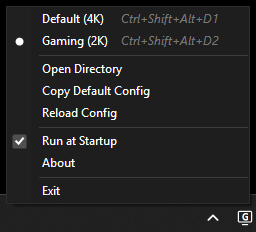

# DisplayConfTray

A system tray utility for switching between display profiles:
- Resolution
- Refresh rate
- Scale



---
## Requirements

.NET 10 is required. Use either installation method:
- Download .NET 10 from [here](https://dotnet.microsoft.com/en-us/download/dotnet/10.0).
- WinGet: `winget install -e --id Microsoft.DotNet.DesktopRuntime.10`.

---
## Usage

- Download the latest release from [here](https://github.com/xUMR/DisplayConfTray/releases).
- Run the executable.
- Use the **Create Config** option to generate an initial `config.json` file, populated with the correct monitor IDs.
- Assigning the same hotkey to multiple display profiles will allow cycling through them.
- When duplicating displays, the refresh rate may require correction.

### Example config (`config.json`):
```json
[
  {
    "Name": "Default (4K)",
    "IconText": "4",
    "MonitorId": "MONITOR\\XXXXXXX",
    "Resolution": "3840x2160",
    "RefreshRate": 120,
    "Scale": 150,
    "Hotkey": "Ctrl+Shift+Alt+1"
  },
  {
    "Name": "Gaming (2K)",
    "IconText": "G",
    "MonitorId": "MONITOR\\XXXXXXX",
    "Resolution": "2560x1440",
    "RefreshRate": 240,
    "Scale": 100,
    "Hotkey": "Ctrl+Shift+Alt+2"
  }
]
```
